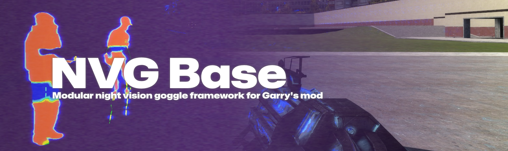

Modular base for developers to create Night Vision Goggles for Gmod. Features a loadout system, player model whitelisting, overlay animations and transitions, post-processing, opaque overrides and more. The base also comes with an API with convenience functions in order to easily integrate with gamemodes and other addons. The following documentation is not a tutorial, for a complete example of what is possible with this framework, please see the following project:
https://github.com/JWalkerMailly/SplinterCellNVG

### Table of contents
1. Controls
2. Loadouts
3. Whitelist
4. API

## Controls
Controls are defined with clientside ConVars. Users can define their own in the console with the following commands:
| Command | Default | Values | Description |
|---|---|---|---|
| NVGBASE_INPUT | 24 (KEY_N) | 1 to 159 | Key used to toggle goggle. Refer to this page for the values: https://wiki.facepunch.com/gmod/Enums/KEY |
| NVGBASE_CYCLE | 23 (KEY_M) | 1 to 159 | Key used to switch goggle. Refer to this page for the values: https://wiki.facepunch.com/gmod/Enums/KEY |

## Loadouts
Loadout configurations need to be defined inside a lua file inside a folder named *nvgloadouts*. If you are creating an addon, this should be your folder structure:
```
your_addon/lua/nvgloadouts/your_loadout.lua
```

### Loadout template file
Here is the structure of a loadout, this is not a tutorial, it is simply a reference template file. If you are looking for a more in depth example of what is possible with this base, please see the following project as reference: https://github.com/JWalkerMailly/SplinterCellNVG
```lua
local TEMPLATE = {};
TEMPLATE.Goggles = {};

-- Base settings.
TEMPLATE.Settings = {

	-- Animation gesture to use if your playermodels support it.
	Gestures = {
		On = nil,
		Off = nil
	},

	-- Bodygroup to set if your playermodels have special bodygroups for goggles on/off.
	BodyGroups = {
		Group = nil,  -- Should be an int, or nil if you don't use bodygroups
		Values = {
			On = nil, -- Should be an int, or nil if you don't use bodygroups
			Off = nil -- Should be an int, or nil if you don't use bodygroups
		}
	},

	-- Goggle overlays.
	-- Goggle is a static fullscreen texture.
	-- Transition is the texture used when animating the transition in and out.
	Overlays = {
		Goggle = nil,    -- Should be a Material() or nil
		Transition = nil -- Should be a Material() or nil
	},

	-- Transition timings for transition overlay.
	Transition = {
		Rate = 5,
		Delay = 0.225,
		Switch = 0.5,
		Sound = nil -- String representing the path to the sound file.
	},

	-- True to remove on death, false otherwise.
	RemoveOnDeath = true
};

-- First goggle settings.
TEMPLATE.Goggles[1] = {

	Name = "first_goggle_name",

	-- Whitelist should be a table of playermodel strings.
	Whitelist = nil,

	-- Full screen material overlay.
	MaterialOverlay   = nil,   -- Should be a material or nil
	OverlayFirst      = false, -- Used to swap rendering order between this and Overlays.Goggle

	-- Full screen material overlay.
	MaterialInterlace = nil,   -- Should be a material or nil
	InterlaceColor    = Color(255, 255, 255, 255),

	-- Material to apply to every entity that passes the filter function.
	MaterialOverride  = nil, -- Should be a string path, not a Material
	Filter = function(ent)

		-- This will be ran for every entity. Return true to override entity's material.
		return;
	end,

	-- Goggle sounds table.
	Sounds = {
		Loop      = nil, -- Plays continuously, must be a looping sound.
		ToggleOn  = nil, -- Played once when toggling on.
		ToggleOff = nil, -- Played once when toggling off.
		Activate  = nil  -- Played once then toggling on, used for special effects.
	},

	-- Lighting example. Dynamic lights are expensive and should be small.
	-- This is better suited for illuminating your viewmodel rather than the world itself.
	Lighting = {
		Color      = Color(25, 25, 25),
		Min        = 0,
		Style      = 0,
		Brightness = 1,
		Size       = 200,
		Decay      = 200,
		DieTime    = 0.05
	},

	-- Projected texture example. Use this to illuminate the world rather
	-- than the lighting table as it yields better results.
	ProjectedTexture = {
		FOV        = 140,
		VFOV       = 100,
		Brightness = 2,
		Distance   = 2500
	},

	-- Photosensitive influences the goggles light sensitivity.
	PhotoSensitive = 0.9,

	-- Color correction example.
	ColorCorrection = {
		ColorAdd   = Color(0.2, 0.4, 0.05),
		ColorMul   = Color(0, 0, 0),
		ColorMod   = 0.25,
		Contrast   = 1,
		Brightness = 0.05
	},

	PostProcess = function(self)
		-- Set to nil if you are not doing postprocessing.
		-- * self refers this goggle table.

		-- This is where you would call DrawBloom, DrawSobel, etc.
	end,

	OffscreenRendering = function(self, texture)
		-- Set to nil if you are not doing offscreen rendering.
		-- * self refers this goggle table.
		-- * texture is a full screen material of the player's view before any processing. 
		--   Useful for UV effects.
	end
};

-- Define second goggle of the loadout, so on and so forth.
TEMPLATE.Goggles[2] = {}

-- Register the loadout.
NVGBASE_LOADOUTS.Register("loadout_name", TEMPLATE);
```

### Console Commands
It is possible for the server admins to dictate which loadout should be used on the fly, and set rules regarding whether or not a player can choose its own NVG loadout. Here is a list of all console commands available.

| Command | Values | Description |
|---|---|---|
| NVGBASE_ALLOWPLAYERLOADOUT | 0 or 1 | **admin** Determine if players can choose their own NVG loadout. |
| NVGBASE_GAMEMODELOADOUT | String, name of loadout | **admin** Set loadout on all players. |
| NVGBASE_PLAYERLOADOUT | String, name of loadout | Choose loadout. |

## Whitelist
The whitelist can be turned on or off globally by an administrator of the server. To do so, use the following command:
```
NVGBASE_WHITELIST 0|1
```
When the whitelist if turned off, any goggle from the player's loadout can be used by his player model.

## API
An API ships with this addon to aid developers in interacting with the NVG Base. Here is a list of all available endpoints.

###  **_G:NVGBASE_IsWhitelistOn()**
>
> *Determine if player whitelisting is active on the server. This essentially returns the value of the NVGBASE_WHITELIST ConVar.*
>
>> ##### Returns 
>> true if active, false otherwise.

###  **player:NVGBASE_IsBoundingBoxVisible( target, maxDistance )**
>
> *Determine if an entity is visible by the player.*
>
>> ##### Parameters:
>> | Name | Type | Description |
>> |---|---|---|
>> | target | entity | The entity to test. |
>> | maxDistance | int | Max test distance in hammer units. |
>
>> ##### Returns 
>> true if visible, false otherwise.

###  **player:NVGBASE_AnimGoggle( gogglesActive, anim, bodygroup, on, off )**
>
> *Utility function to animate playermodel. Can also be used to change playermodel bodygroup. Playermodel animation is set using AnimRestartGesture, refer to this link for more information: https://wiki.facepunch.com/gmod/Player:AnimRestartGesture. For more information on bodygroups, see this link: https://wiki.facepunch.com/gmod/Entity:SetBodygroup.*
>
>> Parameters:
>> | Name | Type | Description |
>> |---|---|---|
>> | gogglesActive | bool | Whether the goggle is active or not. |
>> | anim | enum | **optional** The anim (ACT) gesture to use to animate the playermodel. Use nil if not animating. |
>> | bodygroup | int | **optional** The bodygroup ID to modify. Use nil if not changing bodygroup. |
>> | on | int | The bodygroup's "on" value for the goggles. |
>> | off | int | The bodygroup's "off" value for the goggles. |

###  **player:NVGBASE_GetGoggleToggleKey()**
>
> *Return the player's key used to toggle NVG goggle. Refer to this link for more info on keys: https://wiki.facepunch.com/gmod/Enums/KEY*
>
>> Returns Goggle toggle key value.

###  **player:NVGBASE_GetGoggleSwitchKey()**
>
> *Return the player's key used to switch NVG goggle. Refer to this link for more info on keys: https://wiki.facepunch.com/gmod/Enums/KEY*
>
>> Returns Goggle switch key value.

###  **player:NVGBASE_GetNextToggleTime()**
>
> *If you are comparing against this value, simply check that CurTime() is greater for "can toggle".*
>
>> Returns the next time the goggle and be toggled.

###  **player:NVGBASE_GetNextSwitchTime()**
>
> *If you are comparing against this value, simply check that CurTime() is greater for "can switch".*
>
>> Returns the next time the goggle and be switched.

###  **player:NVGBASE_GetLoadout()**
>
> *Utility function to retreive a player's current NVG loadout.*
>
>> Returns full loadout table. Can be used to access all the settings of the current loadout.

###  **player:NVGBASE_SetLoadout( loadoutName )**
>
> *Set which NVG loadout the player should use. Although this can be used on both client and server, it should either be set on both, or server only. Setting it only clientside will cause a desync between the server and the client.*
>
>> Parameters:
>> | Name | Type | Description |
>> |---|---|---|
>> | loadoutName | string | The loadout to use. This is the key name of a registered loadout. |

###  **player:NVGBASE_IsGoggleActive()**
>
> *Determine if the player is currently using a NVG goggle. This essentially returns the player's current ConVar value for NVGBASE_TOGGLE.*
>
>> Returns true if active, false otherwise.

###  **player:NVGBASE_ToggleGoggle( loadout, silent, force )**
>
> *Internal utility function used to toggle a player's goggle. Although this can be used on both client and server, it should either be used on both, or server only. Setting it only clientside will cause a desync between the server and the client.*
>
>> Parameters:
>> | Name | Type | Description |
>> |---|---|---|
>> | loadout | table | Player's current loadout table. |
>> | silent | bool | Set to true to avoid playing toggle sound, false to play. |
>> | force | int | **optional** Use to force set the toggle status. 1 for true, 0 for false. |

###  **player:NVGBASE_SwitchToNextGoggle( loadout )**
>
> *Internal utility function to switch to the next goggle. If whitelisting is on, will switch to the next goggle the user has access to. If whitelisting is off, will cycle through all the goggles.*
>
>> Parameters:
>> | Name | Type | Description |
>> |---|---|---|
>> | loadout | table | Player's current loadout table. |

###  **player:NVGBASE_CanToggleGoggle( key )**
>
> *Utility function to determine if the player can toggle their goggles. If no key is provided, will only take into account timing since last toggle. Providing a key will check to make sure it matches with the player's toggle key. For more info on keys, see this link: https://wiki.facepunch.com/gmod/Enums/KEY*
>
>> Parameters:
>> | Name | Type | Description |
>> |---|---|---|
>> | key | enum | **optional** Key input to test. Useful when used inside a player input hook. |
>
>> Returns true if can toggle, false otherwise.

###  **player:NVGBASE_CanSwitchGoggle( key )**
>
> *Utility function to determine if the player can switch their goggles. If no key is provided, will only take into account timing since last switch. Providing a key will check to make sure it matches with the player's switch key. For more info on keys, see this link: https://wiki.facepunch.com/gmod/Enums/KEY*
>
>> Parameters:
>> | Name | Type | Description |
>> |---|---|---|
>> | key | enum | **optional** Key input to test. Useful when used inside a player input hook. |
>
>> Returns true if can switch, false otherwise.

###  **player:NVGBASE_GetGoggle()**
>
> *Utility function to get the current NVG goggle table of a player.*
>
>> Returns current goggle table. Useful for accessing a goggle's settings.

###  **player:NVGBASE_SetGoggle( loadoutName, name )**
>
> *Utility function to set a goggle on the player. Does not toggle the goggle, will simply set the reference for the next toggle. Although you can use this function, you probably shouldn't.*
>
>> Parameters:
>> | Name | Type | Description |
>> |---|---|---|
>> | loadoutName | string | The loadout to which the goggle being set belongs. |
>> | name | string | The name of the goggle to use when toggling. |
>
>> Returns true on success, false otherwise.

###  **player:NVGBASE_GetPreviousGoggle()**
>
> *Utility function to retreive the player's previous goggle.*
>
>> Returns previous goggle table. Useful for accessing a goggle's settings.

###  **player:NVGBASE_IsWhitelisted( loadout, goggle )**
>
> *Determines if the player is whitelisted for a goggle according to his playermodel. If no goggle is supplied, will do a general check to see if he can use the loadout.*
>
>> Parameters:
>> | Name | Type | Description |
>> |---|---|---|
>> | loadout | table | The loadout to which the goggle being set belongs. |
>> | goggle | int | The goggle key from the loadout. |
>
>> Returns true if whitelisted, false otherwise.